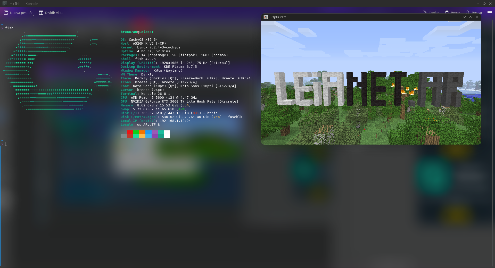

# OptiCraft Heritage - Linux Build (Fork)


---

## 🇦🇷 Español

### Sobre mi fork

OptiCraft Heritage es una reimplementación en C++ del Minecraft clásico
(versión 1.2.5), creada originalmente por OptiProjects, pensada para
correr en hardware modesto y en distintas plataformas (PC, PS2, Wii).

**Este es mi fork** del proyecto, hecho desde Argentina 🇦🇷, enfocado en
agregar y mantener **soporte nativo para Linux**, compilando con
SDL2/OpenGL sobre CMake + Ninja.



### ⚠️ Estado del proyecto

Este fork está en **fase beta**. Podés encontrarte con **bugs**,
comportamiento inestable y **bajo rendimiento** en ciertos escenarios
(carga de chunks, guardado de mundo, etc.). Si algo se rompe, abrí un
issue con el log de consola - ayuda mucho a diagnosticar el problema.

### Requisitos

- Linux x86_64 (probado en distros basadas en glibc moderno)
- CMake ≥ 3.20
- Ninja
- g++ con soporte C++17
- Librerías de desarrollo: SDL2, zlib, OpenGL, PipeWire (según tu distro
  puede venir como `libsdl2-dev`, `zlib1g-dev`, `libpipewire-0.3-dev`, etc.)
- Python 3 (solo para empaquetar los assets)

### Instalación (compilar)
### Adentro de la carpeta contenedora:
```bash
git clone --depth 1 -b SDL2 https://github.com/libsdl-org/SDL_net external/SDL_net
cmake --preset linux-debug
cmake --build --preset linux-debug 2>&1 | tee build.log
```

El ejecutable queda en `bin/Debug/OptiCraft`.

### De dónde sacar los archivos (assets)

> ⚠️ Este repositorio **no incluye assets del juego** (texturas, sonidos,
> fuentes). Son contenido con copyright de Mojang/Microsoft y no se
> redistribuyen acá. Necesitás una copia legítima de Minecraft para
> generarlos vos mismo.

Este motor reimplementa **Minecraft 1.2.5**. Necesitás el `.jar` de esa
versión, sacado con tu propia cuenta/licencia desde el launcher oficial
de Minecraft.

1. Abrí el Minecraft Launcher oficial, creá una instalación con versión
   **Release 1.2.5** y jugala una vez para que se descargue.
2. Ubicá el jar (Linux): `~/.minecraft/versions/1.2.5/1.2.5.jar`

### Cómo sacarlos (empaquetar el assets.pak)

1. Extraé el jar y armá la carpeta esperada:
   ```bash
   mkdir -p /tmp/mcdata/jar_extracted
   unzip ~/.minecraft/versions/1.2.5/1.2.5.jar -d /tmp/mcdata/jar_extracted

   mkdir -p /tmp/mcdata/data/assets /tmp/mcdata/data/resources
   cp -r /tmp/mcdata/jar_extracted/* /tmp/mcdata/data/assets/
   mv /tmp/mcdata/data/assets/newsound /tmp/mcdata/data/resources/ 2>/dev/null
   mv /tmp/mcdata/data/assets/sound /tmp/mcdata/data/resources/ 2>/dev/null
   ```
2. Empaquetá y copiá el `.pak` al lado del ejecutable:
   ```bash
   python3 scripts/make_pak.py /tmp/mcdata/data
   cp /tmp/mcdata/assets.pak bin/Debug/assets.pak
   ```
3. Corré el juego:
   ```bash
   ./bin/Debug/OptiCraft
   ```

### Notas de compatibilidad

- Compilado y probado contra glibc/gcc recientes (Ubuntu 24-ish). En
  distros con glibc/gcc más viejos puede hacer falta ajustar el manejo
  de `struct stat` (`st_mtim` vs `st_mtimespec`) si aparece un error de
  compilación ahí.
- El build depende de la versión de PipeWire del sistema para el backend
  de audio de SDL2; versiones muy nuevas o muy viejas de PipeWire pueden
  requerir ajustes menores en
  `external/SDL2/src/audio/pipewire/SDL_pipewire.c`.
- Este proyecto es un port/fix de comunidad, no oficial. No está afiliado
  a Mojang ni a Microsoft.

### Licencia

Código bajo la licencia del proyecto original OptiCraft Heritage
([GPLv2](LICENSE)), creado por OptiProjects. Los assets del juego
(excluidos de este repo) pertenecen a Mojang Studios / Microsoft - usá
solo una copia que hayas comprado legítimamente.

---

## 🇬🇧 English

### About the project

OptiCraft Heritage is a C++ reimplementation of classic Minecraft
(version 1.2.5), designed to run on modest hardware and across multiple
platforms (PC, PS2, Wii). This repository is an **unofficial fork**
focused on adding and maintaining **native Linux support**, building
with SDL2/OpenGL via CMake + Ninja.


### ⚠️ Project status

This fork is in **beta**. You may run into **bugs**, unstable behavior,
and **low performance** in certain scenarios (chunk loading, world
saving, etc.). If something breaks, please open an issue with the
console log - it helps a lot with diagnosing the problem.

### Requirements

- Linux x86_64 (tested on distros with a modern glibc)
- CMake ≥ 3.20
- Ninja
- g++ with C++17 support
- Development libraries: SDL2, zlib, OpenGL, PipeWire (on your distro
  these may be packaged as `libsdl2-dev`, `zlib1g-dev`,
  `libpipewire-0.3-dev`, etc.)
- Python 3 (only needed to package the assets)

### Installation (building)

```bash
cmake --preset linux-debug
cmake --build --preset linux-debug 2>&1 | tee build.log
```

The executable ends up at `bin/Debug/OptiCraft`.

### Where to get the files (assets)

> ⚠️ This repository does **not** include the game's assets (textures,
> sounds, fonts). They're copyrighted content owned by Mojang/Microsoft
> and are not redistributed here. You need a legitimate copy of
> Minecraft to generate them yourself.

This engine reimplements **Minecraft 1.2.5**. You need that version's
`.jar`, obtained through your own account/license from the official
Minecraft launcher.

1. Open the official Minecraft Launcher, create an installation with
   **Release 1.2.5**, and launch it once so it downloads.
2. Locate the jar (Linux): `~/.minecraft/versions/1.2.5/1.2.5.jar`

### How to get them out (packaging assets.pak)

1. Extract the jar and build the expected folder layout:
   ```bash
   mkdir -p /tmp/mcdata/jar_extracted
   unzip ~/.minecraft/versions/1.2.5/1.2.5.jar -d /tmp/mcdata/jar_extracted

   mkdir -p /tmp/mcdata/data/assets /tmp/mcdata/data/resources
   cp -r /tmp/mcdata/jar_extracted/* /tmp/mcdata/data/assets/
   mv /tmp/mcdata/data/assets/newsound /tmp/mcdata/data/resources/ 2>/dev/null
   mv /tmp/mcdata/data/assets/sound /tmp/mcdata/data/resources/ 2>/dev/null
   ```
2. Package it and copy the `.pak` next to the executable:
   ```bash
   python3 scripts/make_pak.py /tmp/mcdata/data
   cp /tmp/mcdata/assets.pak bin/Debug/assets.pak
   ```
3. Run the game:
   ```bash
   ./bin/Debug/OptiCraft
   ```

### Compatibility notes

- Built and tested against recent glibc/gcc (Ubuntu 24-ish). On distros
  with older glibc/gcc you may need to adjust the `struct stat` handling
  (`st_mtim` vs `st_mtimespec`) if a compile error shows up there.
- The build depends on the system's PipeWire version for SDL2's audio
  backend; very new or very old PipeWire versions may need minor
  adjustments in `external/SDL2/src/audio/pipewire/SDL_pipewire.c`.
- This is an unofficial community port/fix. Not affiliated with Mojang
  or Microsoft.

### License

Code under the original OptiCraft Heritage project's license
([GPLv2](LICENSE)), created by OptiProjects. The game's assets
(excluded from this repo) belong to Mojang Studios / Microsoft - use
only a legitimately purchased copy.
